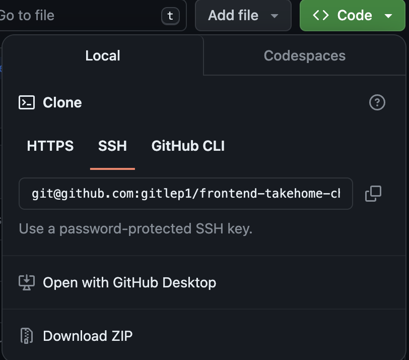
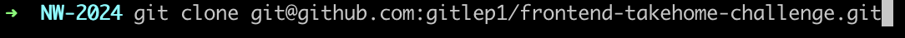
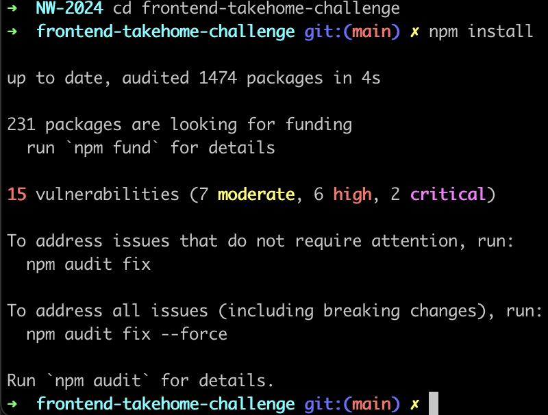
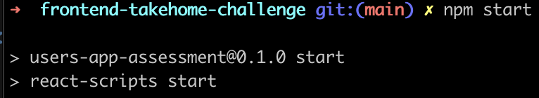

# frontend-takehome-challenge

# Antonio Shivers

## How to run the client locally

1. Select the green "CODE" button and select either https, SSH, or GitHub CLI (whichever you prefer) and copy the url.

   

2. Open a terminal of your choosing and type:

   ```bash
   git clone <the url you copied>
   ```

   

3. cd into the newly cloned repo and install packages:

   ```bash
   npm install
   ```

   

4. Start the client with the command:

   ```bash
   npm start
   ```

   

5. CONGRADULATIONS! You're now running the client locally.

## Link to google doc

https://docs.google.com/document/d/1EybeemZxNrIwlZqvCyDCsxQokDHEuIGsw3QCP-20SfE/edit?usp=sharing
