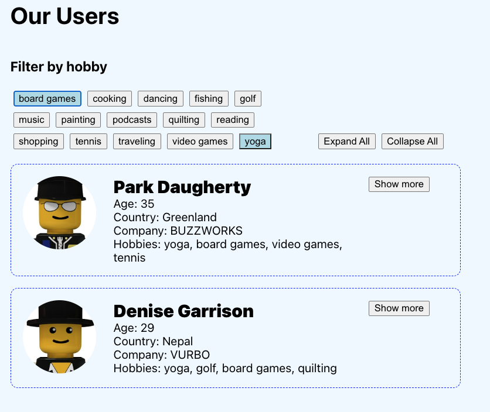
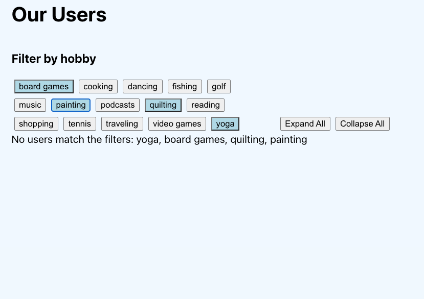

# Users app practice assessment

## Getting started and submitting
1. Fork and clone this repo
1. run `npm install` to install, then `npm start` to start.
1. Implement the requirements below.
1. Submit your work as a pull request to the upstream (a PR against this repo).

## Functional requirements
### 1. Fetching the list of users

- Fetch the data from the external API: https://users-app-backend.onrender.com/users You must use `fetch`.
- Show a loading state while the API call is in progress.
- Show an error state if the API call returns an error response, or if any other error occurs while fetching data. You **must** display the error message. Do not replace the error message with hard-coded text.
You can expect that the API returns error responses with the json: `{ error: 'some error message' }`
- Display the list of users. Many of the components you need for this are already in this repo.

### 2. Expand / Collapse user information
- Implement a button that shows / hides the `about` paragraph for a user.
- Implement an `Expand All` button that, when clicked, expands all the cards regardless of their current state.
- Implement a `Collapse All` button that, when clicked, collapses all the cards regardless of their current state.

### 3. Filter by hobbies
Each user has a list of `hobbies`. Some hobbies are shared by many users, and some are unique to a user. We want to build a UI that filters users by their hobbies.

- For each user, on a line below `Company`, display a comma separated list of the user's hobbies. The hobbies should be visible at all times (put it above the area that is hidden when the card is collapsed).
- For each **distinct** hobby in the data, create a button in the `<FilterBar />` component. Make sure there are no duplicates! For example there should be **only one** button for `yoga` even if many people have `yoga` as a hobby.
- The hobby buttons should be displayed in alphabetical order.
- Dynamically generate the list of hobby buttons. **Do not hard code the hobbies in your application.** If you hard-code them, that is an automatic fail.
- Each hobby button should have two states: selected or not selected. When selected, the button should have a colored background. Clicking a button toggles its state between selected and not selected.
- When a hobby button is selected, filter the list of users. Show only the users who have that hobby.
- When ***more than one*** hobby button is selected, show only the users who have **all** of these hobbies. For example, if `yoga` and `reading` are selected, only show users whose hobbies include `yoga` and `reading`.
    - If a user's hobbies include `yoga` but NOT `reading`, that user should **NOT** be visible.
    - If a user's hobbies include `yoga`, `reading`, and `tennis` (tennis is not selected), that user **SHOULD** be visible.
    - Make sure you understand this feature -- and ask questions ASAP if you don't!
- If no users are displayed (because no user matches all the filters), display the text: `No users match the filters: {comma separated list of selected filters}`

## Non functional requirements
These requirements demonstrate your work quality, reliability, and professionalism as a software engineer. They are just as important as the functional requirements, and you will not pass if any of these are unmet.

1. Submit your project as a pull request to this repo.
1. Do not commit secrets files such as `.env`. You should know how to use `.gitignore` to make sure this doesn't happen.
1. Include a README in the root of your project that explains how to run the project locally. The new README should replace the existing README doc (which you are reading now). Make sure your instructions work!
1. Users should be able to expand or collapse individual cards evern after `Expand All` and `Collapse All` have been clicked.
1. Demonstrate correct understanding of how to lift state up. This means that you **must not** change the component tree. Do not move or remove components, or change any parent-child relationships. However, you **can** (and will have to) add or change props or state in the existing components. You can create new components for loading, error, no results, or to handle layouts and styling.
1. Do not any other major styling changes or add any fancy styling for its own sake.
1. There should be no errors or warnings in the console or in the terminal.
1. There should be no commented-out code in your repo.
1. Your code should be clear and easy to read.
1. Your commit history should be clear and organized: one commit per feature, with a clearly written commit message.
1. Do **not** implement additional features that are not part of the requirements (for example, detail pages, routing, favoriting, sorting, deployment, etc). Stick to the requirements and make sure they are properly and correctly implemented.

## TSHERING GURUNG

### Instructions to Run the Server Locally

1. Clone the repository.
2. Install dependencies by running -- npm install
3. Start the server by running -- npm start
4. The server should now be running locally.

## Markdown Table

| Requirement                      | How I'll Test It             | How I'll Build It                                      |
|----------------------------------|------------------------------|--------------------------------------------------------|
| Fetch data                       | 1. Refresh page              | 1. Created state "user" array                          |
|                                  | 2. Should see users          | 2. Used async await fetch()                             |
|                                  |                              | 3. Set user data using setUser()                        |
|                                  |                              | 4. Passed "user" as a prop to render users             |
| Loading state                    | 1. Throttle to 3G speed      | 1. Created state "loading" false                       |
|                                  |   in dev tools               | 2. Inside fetch request, setLoading to false            |
|                                  | 2. Refresh page              | 3. Set loading to true after response is OK             |
|                                  | 3. Should see error message | 4. Conditional rendering based on loading state         |
| Error state                      | 1. Add ?error=what to URL    | 1. Created state "error"                                |
| (NOT WORKING)                    | 2. Refresh page              | 2. Set error message in catch block when try fails       |
|                                  | 3. Should see error message  |                                                          |
| See more and See less            | 1. Click on see more to expand| 1. Created toggle state array in parent component       |
|                                  | 2. Click on see less to      | 2. Built handleToggle function in parent component       |
|                                  |    collapse                  | 3. Passed toggle and handleToggle to child component    |
|                                  |                              | 4. Received "user" as prop in child component           |
|                                  |                              | 5. Added onClick attribute to button, calling handleToggle|
|                                  |                              | 6. Used ternary for conditional rendering based on toggle|
| Expand All & Collapse All        | 1. Click on Expand to see all| 1. Created handleByExpand function to expand all cards  |
|                                  |    the cards                 | 2. Created handleByCollapse function to collapse all    |
|                                  | 2. Click on Collapse all to  |    cards                                                 |
|                                  |    see all the cards collaps | 3. Passed functions to FilterBar component              |
|                                  |                              | 4. Created buttons for expand all and collapse all      |
|                                  |                              | 5. Added onClick attribute to call handleByExpand and   |
|                                  |                              |    handleByCollapse                                     |
| Filter by hobbies                | 1. Click on hobbies button   | 1. Created selectedHobby state in App.js               |
| (NOT WORKING AS INTENDED)        |                              | 2. Created handleFilterBtnClick function to add hobbies |
|                                  |                              | 3. Constructed filterByHobbies function to filter users |
|                                  |                              |    based on hobbies                                     |
|                                  |                              | 4. Passed selectedHobby and handleFilterBtnClick to     |
|                                  |                              |    FilterBar component                                  |
|                                  |                              | 5.used useEffect to run filterByHobbies with 
|                                  |                              |   selectedHobby as dependecy.
|                                  |                              | 5. Received selectedHobby and handleFilterBtnClick as   |
|                                  |                              |    props in FilterBar component                         |
|                                  |                              | 6. onClick event calls handleFilterBtnClick             |
