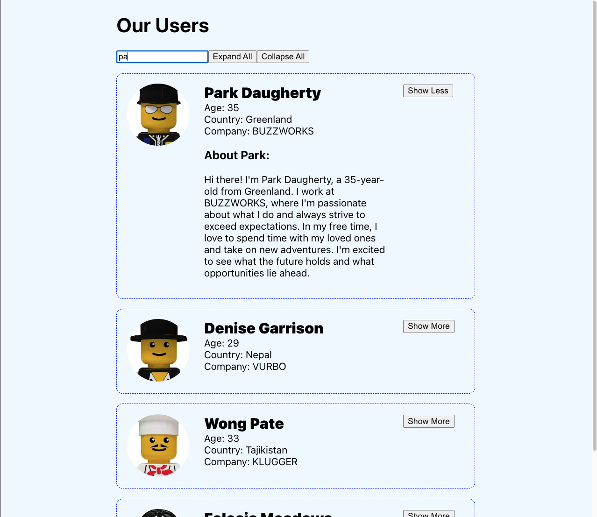

# Users app practice assessment

## Getting started and submitting
1. Fork and clone this repo
1. run `npm install` to install, then `npm start` to start.
1. Implement the requirements below.
1. Submit your work as a pull request to the upstream (a PR against this repo).

## Functional requirements
### 1. Fetching the list of users

- Fetch the data from the external API: https://users-app-backend.onrender.com/users You must use `fetch`.
- Show a loading state while the API call is in progress.
- Show an error state if the API call returns an error response, or if any other error occurs while fetching data. You **must** display the error message. Do not replace the error message with hard-coded text.
You can expect that the API returns error responses with the json: `{ error: 'some error message' }`
- Display the list of users. Many of the components you need for this are already in this repo.

### 2. Expand / Collapse user information
- Implement a button that shows / hides the `about` paragraph for a user.
- Implement an `Expand All` button that, when clicked, expands all the cards regardless of their current state.
- Implement a `Collapse All` button that, when clicked, collapses all the cards regardless of their current state.

### Filter by hobbies
Each user has a list of `hobbies`. Some hobbies are shared by many users, and some are unique to a user. We want to build a UI that filters users by their hobbies.

- For each **distinct** hobby in the data, create a button in the `<FilterBar />` component. Make sure there are no duplicates! For example there should be **only one** button for `yoga` even if many people have `yoga` as a hobby.
- Each hobby button should have two states: selected or not selected. When selected, the button should have a colored background. Clicking a button toggles its state between selected and not selected.
- When a hobby button is selected, filter the list of users. Show only the users who have that hobby.
- When ***more than one*** hobby button is selected, show only the users who have **all** of these hobbies. For example, if `yoga` and `reading` are selected, only show users whose hobbies include `yoga` and `reading`.
    - If a user's hobbies include `yoga` but NOT `reading`, that user should **NOT** be visible.
    - If a user's hobbies include `yoga`, `reading`, and `tennis` (tennis is not selected), that user **SHOULD** be visible.
    - Make sure you understand this feature -- and ask questions ASAP if you don't!

## Non functional requirements
These requirements demonstrate your work quality, reliability, and professionalism as a software engineer. They are just as important as the functional requirements, and you will not pass if any of these are unmet.

1. Submit your project as a pull request to this repo.
1. Include a README in the root of your project that explains how to run the project locally. The new README should replace the existing README doc (which you are reading now). Make sure your instructions work!
1. Users should be able to expand or collapse individual cards evern after `Expand All` and `Collapse All` have been clicked.
1. Demonstrate correct understanding of how to lift state up. This means that you **must not** change the component tree. Do not move or remove components, or change any parent-child relationships. However, you **can** (and will have to) add or change props or state in the existing components. You can create new components for loading, error, no results, or to handle layouts and styling.
1. Do not any other major styling changes or add any fancy styling for its own sake.
1. There should be no errors or warnings in the console or in the terminal.
1. There should be no commented-out code in your repo.
1. Your code should be clear and easy to read.
1. Your commit history should be clear and organized: one commit per feature, with a clearly written commit message.
1. Do **not** implement additional features that are not part of the requirements (for example, detail pages, routing, favoriting, sorting, deployment, etc). Stick to the requirements and make sure they are properly and correctly implemented.

## Planning, communication, and work quality
The deadline is **12 pm, Sunday, August 27**.
You must request an extension by DM **before 9 am on Thursday, August 24**.

### Plan ahead
- Review this assignment **right now** and determine whether you can complete this by the deadline.
- Start working on this assignment **right now**. Don't wait until later.

### Communication
- If you need more time, send me a DM **ASAP**. Tell me exactly when you can submit the assignment.
- You must request an extension by DM **before 9 am on Thursday, August 24**.
- If you submit the asssignment late without informing me before that date, I will not review your work.

### Work quality
Treat this like a real takehome interview:
- submit your very best work by the deadline
- do not submit work that you know is incomplete and/or does not meet all of the requirements above
- be 100% certain that your code on GitHub is exactly the same as the code you are running on your computer
- if you hit an unexpected bug or technical snag while working on the project, post a question in the Slack channel **ASAP**

