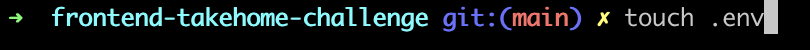

# frontend-takehome-challenge

# Antonio Shivers

## How to run the client locally

1. Select the green "CODE" button and select either https, SSH, or GitHub CLI (whichever you prefer) and copy the url.

   

2. Open a terminal of your choosing and type:

   ```bash
   git clone <the url you copied>
   ```

   

3. cd into the newly cloned repo and install packages:

   ```bash
   npm install
   ```

   

4. open the file with a text editor of your choice (I'll be using vscode for this exmaple)

   ```bash
   code .
   ```

   

5. Create a .env file and make sure it's included in your .gitignore so you don't commit it to github

   ```bash
   touch .env
   ```

   

6. Inside the .env file add REACT_APP_API_URL along with the api url

   ```bash
   REACT_APP_API_URL="https://users-app-backend.onrender.com"
   ```

   

7. Start the client with the command:

   ```bash
   npm start
   ```

   

8. CONGRADULATIONS! You're now running the client locally.

## Link to google doc

https://docs.google.com/document/d/1EybeemZxNrIwlZqvCyDCsxQokDHEuIGsw3QCP-20SfE/edit?usp=sharing
